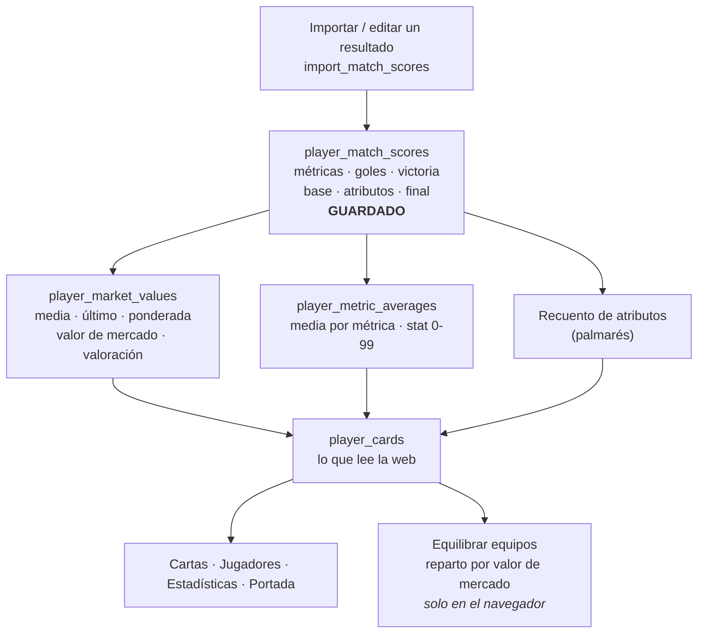

# Cómo se calcula todo

Todos los números que aparecen en la aplicación, de dónde salen y en qué orden
se derivan unos de otros. Está en castellano porque explica las reglas de la
liga; los comentarios del código y el resto de la documentación técnica están en
inglés.

## La idea que hay que tener clara antes de leer el resto

Lo único que se guarda de un jugador es **su fila en un partido**
(`player_match_scores`), y sus columnas son de dos clases muy distintas.

**Lo que se registra tal cual**, lo que alguien ha escrito en el CSV o en el
formulario:

| Dónde                           | Qué es                                 |
| ------------------------------- | -------------------------------------- |
| `metric_scores`                 | las notas de las cuatro métricas, 0-10 |
| `goals`                         | goles marcados                         |
| `victory`                       | 1 ganó, 0,5 empató, 0 perdió           |
| `player_match_score_attributes` | los atributos concedidos, en su tabla  |

**Lo que se guarda ya calculado**, las tres cifras que `import_match_scores`
deriva de las anteriores y escribe en la misma fila:

| Columna            | Qué es                                                  |
| ------------------ | ------------------------------------------------------- |
| `base_score`       | la suma de las métricas de ese partido                  |
| `attribute_points` | lo que suman sus atributos de ese partido               |
| `final_score`      | la puntuación final: base + atributos + 2 × la victoria |

La victoria está en las dos listas y no es una redundancia: se guarda cruda
porque el porcentaje de victorias y los totales la necesitan por separado, y ya
va sumada dentro de `final_score` porque ganar puntúa. Los goles, en cambio, no
entran en ninguna puntuación.

Todo lo demás — valor de mercado, valoración 0-99, medias, estadísticas de la
carta, palmarés, totales — son **vistas de PostgreSQL**: no están almacenadas en
ningún sitio, se recalculan enteras cada vez que alguien las lee. No hay ningún
trigger, ni ningún proceso nocturno, ni ninguna caché que haya que invalidar en
la base de datos.

Esto tiene tres consecuencias prácticas:

- Corregir un partido actualiza **al instante** todo lo que dependa de él. No
  hay nada que "recalcular".
- Cambiar una **fórmula** (una migración nueva) no arregla los partidos ya
  guardados, porque su `final_score` está escrito en la tabla. Cambiar la
  fórmula exige recalcular la historia a mano, como hizo la migración 009.
- Editar `metric_scores`, `goals` o `victory` a mano en el editor de tablas
  **no** recalcula las tres cifras derivadas. Para corregir un resultado hay que
  reimportarlo.



## 1. Vocabulario y escalas

| Concepto           | Escala    | Quién la define                                              |
| ------------------ | --------- | ------------------------------------------------------------ |
| Métrica            | 0 a 10    | `league_metrics` (por liga, `minimum_score`/`maximum_score`) |
| Puntuación base    | 0 a 40    | la suma de las cuatro métricas activas                       |
| Atributo           | −2 a +2   | `league_attributes.points`                                   |
| Victoria           | 0 a 1     | 1 ganó, 0,5 empató, 0 perdió                                 |
| Puntuación final   | sin topes | base + atributos + victoria × 2                              |
| Valoración (carta) | 45 a 99   | posición relativa en la liga                                 |
| Stat de métrica    | 0 a 99    | media de la métrica × 10                                     |
| Valor de mercado   | libras    | valoración × constante de la liga                            |

Las métricas por defecto de la liga son **Ataque, Defensa, Táctica y Físico**,
de 0 a 10 cada una. Son datos de referencia por liga: si un día se añade una
quinta, la escala base pasa a 0-50 sin tocar código.

Los atributos por defecto son **MVP, Jugador revelación, Zamora, Puskas y
Pichichi** (+2 cada uno) y **Lesión** (−2).

## 2. La puntuación de un partido

Es el único cálculo que se **escribe**. Lo hace la función
`import_match_scores`, tanto si el resultado llega por CSV como si se edita
jugador a jugador desde la ficha del partido.

```text
base            = Ataque + Defensa + Táctica + Físico
atributos       = suma de los points de los atributos concedidos
puntos victoria = victoria × 2
final           = base + atributos + puntos victoria
```

Ejemplo, el del README: un jugador con 6 de Ataque, 9 de Defensa, 8 de Táctica y
7 de Físico, MVP del partido, en el equipo que ganó:

```text
base   = 6 + 9 + 8 + 7 = 30
MVP    = +2
ganó   = 1 × 2 = +2
final  = 34
```

Detalles que importan:

- **Es una suma, no una media.** Ser bueno en todo tiene que puntuar más que ser
  bueno en una cosa; con la media eso no se veía.
- **Los goles no puntúan.** Se guardan y se muestran (y ordenan el podio de
  goleadores), pero no entran en ninguna puntuación. El Pichichi sí, como
  atributo.
- **Los dos puntos de la victoria no son configurables.** Viven en la función
  `victory_points()` porque forman parte de la definición de la puntuación, no
  son un ajuste de liga.
- **La final no se recorta.** Un Puskás y un MVP sobre un buen partido pueden
  pasar de 40, y una lesión puede dejar la final por debajo de cero. Las dos
  cosas son intencionadas.
- **La victoria es una fracción, no un sí/no.** El empate vale 0,5, y la columna
  acepta cualquier valor entre 0 y 1 para los partidos que se resuelven de otra
  manera. El formulario de la web ofrece solo las tres habituales.

### Qué rechaza la base de datos

La validación está en la función, no en el navegador, así que vale igual para el
CSV y para el formulario:

- una métrica que falte, que no sea un número, o que esté fuera de su rango;
- una métrica que no exista o no esté activa en la liga (no se ignora: se
  rechaza, porque una métrica mal escrita desaparecería del total sin avisar);
- goles que no sean un entero de 0 o más;
- una victoria fuera de 0-1;
- un atributo desconocido, inactivo o repetido en la misma fila;
- un jugador que no exista en la liga, que no estuviera convocado, o que
  aparezca dos veces en el mismo envío;
- un partido cancelado.

Si algo falla, **no se escribe nada**: la función es transaccional, así que un
CSV con un error en la fila 9 no deja ocho jugadores puntuados.

### Reimportar y editar

Reimportar un partido lo **corrige**: las puntuaciones se reemplazan por
`(partido, jugador)` y el conjunto de atributos de ese jugador se reescribe
entero en lugar de acumularse. Editar un jugador desde la web es exactamente lo
mismo con una sola fila. Cualquiera de las dos vías marca el partido como
`scored`.

## 3. Las cifras de carrera

De aquí en adelante nada se guarda: son vistas. Solo cuentan los partidos con
estado `scored`, así que un partido programado que nadie ha jugado nunca arrastra
a nadie hacia abajo. La sección 13 detalla qué estados cuentan y desde cuándo.

| Cifra                        | Cómo se calcula                                     |
| ---------------------------- | --------------------------------------------------- |
| `matches_played`             | cuántos partidos puntuados tiene                    |
| `career_average`             | media de sus `final_score`                          |
| `latest_score`               | la final de su partido más reciente                 |
| `weighted_performance_score` | ver abajo                                           |
| `total_goals`                | suma de goles                                       |
| `total_victories`            | suma de fracciones de victoria (un empate suma 0,5) |

"El más reciente" se decide por `played_at` descendente y, si dos partidos
comparten hora, por orden de creación — así "el último" nunca es ambiguo.

### Estadísticas específicas ponderadas

```text
1 partido       → estadística = nota de ese partido
2 o más         → estadística = 0,5 × media anterior + 0,5 × último partido
```

Esto se calcula por separado para cada estadística específica: Ataque, Defensa,
Táctica, Físico, o las que configure la liga. Si alguien tenía 6 de media en
Ataque y en el último partido hizo 10, su Ataque actual es 8.

### Puntuación ponderada para la valoración

La valoración general usa la puntuación final del partido, porque ahí ya están
sumadas la Victoria y los Atributos. Primero se normaliza sobre la capacidad de
las métricas:

```text
valoración de partido = final_score / 40 × 10
```

Con las cuatro métricas por defecto, 40 es el máximo de estadísticas base. Si la
liga cambia las métricas, la base es la suma de sus máximos activos.

Después se pondera igual:

```text
1 partido       → ponderada = valoración de ese partido
2 o más         → ponderada = 0,5 × media anterior + 0,5 × último partido
```

Ejemplo: 36 puntos de estadísticas + 2 de Victoria + 2 de MVP = 40. La
valoración de ese partido es `40 / 40 × 10 = 10`. Si además tuvo Puskas, serían
42 y contaría como `10,5` para la valoración.

Los goles no puntúan por sí solos; solo cuentan si llegan como un atributo, por
ejemplo Pichichi.

## 4. Confianza y ajuste

La confianza mira la disponibilidad reciente: de los **últimos 6 partidos
puntuados de la liga**, cuántos ha jugado ese jugador.

```text
participación real = partidos jugados de esos 6 / 6 × 100
confianza visual   = 100 si participación real > 60; si no, participación real
```

La carta enseña esa confianza como un donut azul pequeño, sin número. Cuatro de
seis partidos ya llenan el donut, porque es más de 60%.

Después de calcular la valoración 45-99 por distribución se aplica el ajuste:

```text
valoración final = suelo(valoración − 10 × (100 − participación real) / 100)
```

Ejemplos:

```text
99 con 1 partido de 6  →  99 − 10 × 83,333% = 90
77 con 2 partidos de 6 →  77 − 10 × 66,667% = 70
```

Esta valoración final es la que ve la aplicación y la que se usa para el valor
de mercado.

### Estado de forma

El estado de forma se decide por prioridad, usando la valoración de partido
normalizada (`final_score / 40 × 10`):

1. Fuego: los últimos 3 partidos suben progresivamente.
2. Hielo: los últimos 3 partidos bajan progresivamente.
3. Flecha abajo: el último partido está al menos 5% por debajo de su media
   histórica anterior.
4. Flecha arriba: el último partido está al menos 5% por encima de su media
   histórica anterior.
5. Sin icono: nada de lo anterior.

## 5. Valor de mercado

```text
valor = valoración de carta × market_constant_gbp
```

`market_constant_gbp` es un ajuste por liga (editable en **Ajustes de la liga**),
3.000.000 por defecto.

```text
valoración 82  →  82 × 3.000.000  =  £246.000.000  →  se muestra «£246 M»
```

Un jugador **sin partidos puntuados** no tiene valoración ganada todavía, así
que se coloca en el centro, 72, salvo que el administrador haya indicado una
aproximación de valor.

### La aproximación del administrador

Al crear o editar un jugador, un administrador puede indicar una **aproximación
de valor de mercado**. Sustituye al centro mientras el jugador no tenga
partidos, y a nada más:

```text
sin partidos  →  aproximación, si la hay; si no, valoración 72
1 partido o más  →  la fórmula de arriba, sin cambios
```

Sirve para una cosa concreta: **Equilibrar equipos** reparte por valor de
mercado, así que un fichaje al que se le presupone nivel deja de contar como
uno del montón desde el primer partido, que es justo cuando el reparto no tiene
otro dato en el que apoyarse.

La cifra se escribe en libras y se guarda en libras, pero se lee como valoración
provisional: la vista la divide entre `market_constant_gbp`. Y no se borra
cuando deja de usarse — queda en la ficha como registro de lo que se pensó.

El valor se muestra abreviado (`£96 M`, `£750 K`) en listas y cartas, y exacto en
la ficha del jugador.

## 6. Valoración de la carta (45-99)

**No es una medida, es una posición.** Responde a "dónde está la última
actuación de este jugador dentro de lo que ha hecho la liga", no a "qué nota
tiene".

```text
valoración = recortar(  redondear( 72 + 18 × (ponderada − media) / desviación ),  45, 99)
```

- **media** y **desviación**: de la puntuación ponderada de valoración de cada
  jugador de la liga que haya jugado alguna vez. Desviación de población, no de
  muestra, porque la liga entera es la población y no una estimación sacada de
  ella.
- Centro en 72, dieciocho puntos por desviación típica, y topes duros en 45 y 99. Es agresiva a propósito: separa claramente jugadores flojos, medios y
  fuertes.
- Si nadie ha jugado, o si todos tienen exactamente la misma última puntuación,
  no hay reparto en el que colocar a nadie: **todos valen 72**.

Ejemplo: la liga tiene una media de 8 en puntuación ponderada, con desviación 1.
Un jugador que está en 9:

```text
72 + 18 × (9 − 8) / 1 = 90
```

Dos consecuencias que son parte del diseño y conviene entender:

1. **La valoración de un jugador se mueve cuando juegan otros.** Es una
   posición: si la liga entera mejora, quedarse igual es bajar.
2. **Todas las valoraciones cambian después de cada partido.** La carta es una
   foto del momento; el histórico sigue estando en las cifras de carrera.

### Colores de la carta

Puramente visual, y lo decide el frontend (`src/lib/scoring.ts`), no la base de
datos: **oro** desde 75, **plata** desde 60, **bronce** por debajo.

## 7. Equilibrar equipos

Un botón en la página del partido, solo para el administrador y solo mientras el
partido no se haya jugado. Reparte la convocatoria en dos equipos y los coloca
sobre los dos campos.

### Qué intenta conseguir

Una sola cosa, medible:

```text
diferencia = | valor de mercado del local − valor de mercado del visitante |
```

y el reparto que **minimiza esa diferencia**, con dos restricciones:

- los dos equipos tienen el mismo número de jugadores (si la convocatoria es
  impar, el jugador de más va al local);
- cuenta **toda** la convocatoria, banquillo incluido: un equipo son sus
  titulares y sus suplentes, y quien entra en el minuto 20 también juega.

### El valor que se ve en la página del partido

Bajo el nombre de cada equipo, la página del partido muestra lo que vale ese
equipo, y encima de los dos campos la diferencia entre ambos. Sirve para
auditar el reparto: se ve si el botón lo dejó igualado y si alguien lo
desigualó después arrastrando a un jugador.

Dos avisos, porque **esa cifra no es la que el botón minimiza**:

- **El banquillo no cuenta.** La cifra suma solo a quien está sobre el campo,
  porque es lo que se está mirando. El botón, en cambio, reparte contando toda
  la convocatoria (arriba). En una convocatoria impar los dos números pueden no
  coincidir: el reparto está equilibrado según su propia definición y la
  pantalla enseña otra.
- **Se congela al puntuar.** Ver hoy un partido de hace un mes con los valores
  de hoy no dice nada: ese mismo partido es lo que los movió. Así que la primera
  vez que se importa un resultado, el valor que cada convocado traía **antes**
  del partido se guarda en su fila de la convocatoria y ya no se mueve, ni
  aunque se corrija el acta. Un partido por jugar enseña valores actuales. El
  pie de la tarjeta dice cuál de las dos cosas está mostrando.

Los cuatro partidos que ya estaban jugados cuando apareció la columna no tienen
valor congelado y nunca lo tendrán: los de hoy no son los de entonces, y
rellenarlos sería inventárselo. Esos se muestran con valores actuales.

### Por qué el valor de mercado y no la valoración

De las dos cifras grandes de una carta, el valor de mercado es la que se puede
**sumar**:

| Cifra                | Qué es                                          | ¿Sumable? |
| -------------------- | ----------------------------------------------- | --------- |
| Valor de mercado (£) | valoración × constante — una **cantidad**       | sí        |
| Valoración 45-99     | posición relativa en la liga — un **percentil** | no        |

La valoración está centrada en 72 y recortada entre 45 y 99, así que comprime
justo lo que aquí interesa: dos jugadores separados por una diferencia real de
juego pueden acabar en 88 y 84, y sumar percentiles recortados reparte peor que
sumar cantidades. El valor de mercado escala esa valoración para convertirla en
una cantidad sumable.

Son cifras hermanas, no independientes: las dos salen del mismo
`player_match_scores`, así que equilibrar por valor deja las valoraciones medias
de los dos equipos muy parecidas de todas formas.

Un detalle que importa: **un debutante no vale cero.** La vista
`player_market_values` lo coloca en 72, o en la aproximación del administrador
si existe, así que entra al reparto como un jugador razonable y no como lastre
(ver el apartado 5).

### Cómo se busca el reparto

Es el problema de la partición equilibrada. Con veinte jugadores hay del orden
de 10⁵ repartos posibles, así que se busca el **óptimo exacto**, no una
aproximación:

1. Ordenar la convocatoria por valor **descendente**.
2. Recorrer a los jugadores en ese orden, probando cada uno en los dos equipos
   (primero en el que va por detrás), y respetando el cupo de cada lado.
3. **Podar**: si la diferencia actual no se puede cerrar ni echando todo el valor
   que queda por repartir al equipo más ligero, esa rama no puede ganar y se
   abandona.
4. Si aparece un reparto con diferencia cero, no hay nada mejor y se para.

El orden descendente es lo que hace que la poda funcione: los jugadores caros se
colocan primero, así que la diferencia se hace grande enseguida y lo que queda
para cerrarla es poco. En la práctica se resuelve en milisegundos. Hay un tope de
nodos por si alguien convoca a media isla; si se agotara, devuelve el mejor
reparto encontrado, que nunca es peor que el reparto codicioso.

Es **determinista**: a igualdad de valor los jugadores se ordenan por su
identificador, así que la misma convocatoria da siempre los mismos equipos y
pulsar el botón dos veces no cambia nada.

### Cómo se colocan sobre el campo

Con los equipos ya decididos, cada lado se coloca así:

- **portería** (posición 0): un jugador cuya posición preferida sea GK; si el
  equipo no tiene ninguno, el **más barato** de ese lado;
- **el resto**, de más caro a más barato, ocupando las posiciones 1 en adelante;
- quien no cabe en el campo, **al banquillo**. Caben tantos como jugadores por
  equipo tenga el partido: de cinco a ocho, siete por defecto.

### Un ejemplo

Convocatoria de seis, con estos valores:

| Jugador | Valor |
| ------- | ----- |
| A       | £96 M |
| B       | £84 M |
| C       | £72 M |
| D       | £60 M |
| E       | £51 M |
| F       | £45 M |

El total es £408 M, así que el reparto perfecto serían £204 M por lado. No
existe: con tres jugadores por equipo lo más cerca que se puede llegar es

```text
Local      A + D + E = 96 + 60 + 51 = £207 M
Visitante  B + C + F = 84 + 72 + 45 = £201 M
diferencia                            £6 M
```

y eso es lo que devuelve la búsqueda. El aviso que sale al pulsar el botón dice
exactamente esa diferencia.

### Dónde vive

**`src/lib/teamBalance.ts`**, en el navegador y a propósito. Todas las fórmulas
que producen un **dato** viven en PostgreSQL, y las que hay en el frontend son
espejos para previsualizar (`scoring.ts`) o reconstrucciones de algo que la base
de datos no guarda (`evolution.ts`). Esta no es ninguna de las dos: es una
**propuesta**. Cualquier reparto es una alineación legal, así que no hay nada que
la base de datos deba validar ni guardar, y el resultado se escribe por el mismo
camino que mover las cartas a mano (`saveLineup`). Lo único autoritativo que usa
—`player_cards.market_value_gbp`— sí viene de la base de datos.

`src/lib/teamBalance.test.ts` comprueba el óptimo contra una fuerza bruta escrita
aparte, incluido un caso en el que el reparto codicioso se queda en una
diferencia de 5 y el óptimo es 1.

## 8. Las estadísticas por métrica de la carta (0-99)

```text
stat = recortar( redondear( media de la métrica × 10 ), 0, 99)
```

La media es la de esa métrica en todos sus partidos puntuados. Un jugador con 6,5
de media en Ataque lleva un **65** en la carta.

Si una métrica se añade después de que se jugaran partidos, esos partidos
antiguos no tienen valor para ella y se **excluyen** de la media en lugar de
contar como cero.

## 9. Recuentos y porcentajes

| Dónde                            | Cálculo                                                         |
| -------------------------------- | --------------------------------------------------------------- |
| Palmarés / atributos de la carta | cuántas veces ha recibido cada atributo, en partidos puntuados  |
| % de victorias                   | `victorias / partidos jugados`, siempre acompañado del recuento |
| Valor total (portada)            | suma del valor de mercado de los activos, sin invitados         |
| Partidos puntuados (portada)     | partidos con estado `scored`                                    |

El porcentaje de victorias nunca va solo: un 100 % de un partido no es lo mismo
que un 80 % de diez, así que la interfaz siempre muestra `victorias/partidos` al
lado.

## 10. La pantalla de Estadísticas

Solo entran jugadores **activos, no invitados y con al menos un partido
puntuado**. Incluir a quien no ha jugado sería listar sobre un valor de relleno
compartido, que parece una clasificación y no lo es.

### Los jugadores invitados

Un invitado es alguien que juega pero no es de la liga: el que se apunta un día
porque falta gente. Se le convoca, se le puntúa y se le valora igual que a
cualquiera — cuenta para el valor de su equipo y para equilibrar el reparto —
pero **no aparece ni en Liga ni en Estadísticas**, porque una clasificación que
mide a quien vino una vez contra quien viene cada semana no describe bien a
ninguno de los dos.

Lo que **sí** sigue haciendo es contar para la media y la desviación de la liga,
es decir, para la valoración 0-99 de todos los demás. Jugó el partido, y sacarlo
de ahí reescribiría la tarde de los demás. Se marca desde **Administración ›
Jugadores**, en la ficha del jugador.

### General

Cuatro podios de cinco, oro, plata y bronce:

| Podio                        | Se ordena por                                         |
| ---------------------------- | ----------------------------------------------------- |
| Jugadores más valorados      | valor de mercado                                      |
| Jugadores más goleadores     | goles totales                                         |
| Mejor estado de forma actual | valoración 0-99 (que ya es, por definición, la forma) |
| Top jugadores defensivos     | stat 0-99 de la métrica Defensa                       |

Cada podio descarta a quien tenga el valor en cero, así que nadie aparece en
"más goleadores" con cero goles.

### Palmarés

Cuántas veces ha recibido cada atributo cada jugador, un ranking por atributo.

### Evolución

Aquí hay un detalle importante: **la valoración de las jornadas pasadas no está
guardada en ninguna parte.** La función de la base de datos solo sabe calcular la
del momento presente.

Así que la gráfica la **reconstruye** (`src/features/stats/evolution.ts`):
recorre las jornadas de la más antigua a la más nueva, va guardando la última
final de cada jugador, y en cada jornada aplica la misma fórmula al reparto tal
como estaba en ese punto de la temporada.

Reglas de dibujo:

- Quien no juega una jornada **mantiene el valor de la anterior**. Sin esto casi
  todas las líneas se romperían en casi todas las jornadas, porque en un fútbol 7
  rara vez juega la plantilla entera.
- Un jugador **no tiene línea antes de su primer partido**, así que un fichaje
  entra a mitad de la gráfica en lugar de venir plano desde la jornada 1.
- El filtro de medida ofrece **Valoración (0-100)** o cualquiera de las cuatro
  métricas. Las métricas se dibujan con la nota **de ese partido** (0-10), no con
  la media de carrera de la carta.
- Por defecto se dibujan los **siete** jugadores de más valor, y caben **ocho**
  como máximo: a partir de ahí no hay colores que se distingan con fiabilidad, y
  una gráfica ilegible no es un problema de filtros.

Y tres salvedades honestas sobre lo que esa reconstrucción significa:

1. Usa las finales **de hoy**. Si mañana se corrige un atributo de la jornada 2,
   la gráfica reescribe el pasado. Es "el pasado según lo que hay grabado ahora",
   no "lo que las cartas mostraban aquel día".
2. Como quien descansa mantiene su valoración, el punto de un jugador que no jugó
   **no es** lo que la base de datos habría dicho esa semana (ella la habría
   movido, porque la media de la liga cambió).
3. Es un cálculo del cliente. Si algún día hace falta un histórico auditable,
   habría que guardar una foto por jornada al importar.

## 11. El radar de la ficha del jugador

Un vértice por métrica activa de la liga (hoy cuatro), todos en la misma escala
0-99 de la carta, y cada vértice etiquetado con su número: un radar enseña bien
la forma y mal la magnitud, así que las cifras se quedan en el gráfico. El tooltip
añade la media cruda sobre 10.

## 12. Redondeo y precisión

| Cifra                                           | Precisión          |
| ----------------------------------------------- | ------------------ |
| `base_score`, `final_score`                     | 3 decimales        |
| `attribute_points`                              | entero             |
| `victory`                                       | 2 decimales, 0 a 1 |
| `career_average`, `previous_average`, ponderada | 3 decimales        |
| `market_value_gbp`                              | 2 decimales        |
| Valoración, stats de métrica                    | enteros            |

PostgreSQL redondea el 0,5 **alejándose del cero** (`round(2.5) = 3`,
`round(-2.5) = -3`). JavaScript lo redondea hacia arriba, así que el espejo del
frontend implementa la regla de PostgreSQL a mano para no discrepar en los casos
negativos.

En pantalla, las puntuaciones se muestran con uno o dos decimales y con coma
decimal, y los valores de mercado abreviados.

## 13. Cuándo empieza a contar un partido

### El estado del partido es lo único que lo decide

Todas las vistas filtran por `status = 'scored'`. No hay ningún otro criterio: ni
la fecha, ni si el partido ya se jugó, ni si hay convocatoria.

| Estado      | Qué significa                             | ¿Cuenta para las cifras? |
| ----------- | ----------------------------------------- | ------------------------ |
| `draft`     | borrador, todavía no anunciado            | No                       |
| `scheduled` | programado, la gente se apunta            | No                       |
| `played`    | se jugó, pero **nadie ha importado nada** | **No**                   |
| `scored`    | tiene resultados importados               | **Sí, el único que sí**  |
| `cancelled` | cancelado                                 | No                       |

La fila que sorprende es `played`. Un partido puede haberse jugado, estar todo el
mundo en casa y seguir sin aportar absolutamente nada a ninguna puntuación: para
la aplicación es una nota en el calendario. Solo aporta cuando alguien importa
los resultados, y es la propia importación la que pone `scored` — ese estado no
se elige nunca a mano, no aparece en el desplegable del formulario.

### Un partido en curso empieza a contar con el primer jugador puntuado

`import_match_scores` no exige la convocatoria entera. Acepta las filas que le
mandes, y al final marca el partido como `scored`. Así que puntuar a **un solo
jugador** — el caso normal cuando se va rellenando el resultado desde la web,
uno a uno — ya mete el partido en todas las estadísticas.

Lo que pasa a partir de ese momento:

- Ese jugador tiene ya una fila: el partido le cuenta en `matches_played`, entra
  en su media, y su `latest_score` pasa a ser el de este partido.
- El resto de la convocatoria **no aporta nada de este partido**. No es que
  puntúen 0: es que no tienen fila. Su media y su valor no se mueven.
- La **valoración de toda la liga sí se mueve**, porque es relativa a la media y
  la desviación de las últimas puntuaciones de todos, y una de ellas acaba de
  cambiar. Es el mismo efecto descrito en la sección 14, pero disparado a mitad
  de un partido a medio puntuar.

Es decir: los resultados de un partido en curso afectan a las cifras **en cuanto
se guarda cada jugador**, no al terminar de puntuar a todos. Un partido a medio
puntuar no arrastra a nadie hacia abajo, pero sí desplaza las valoraciones.

### Un cambio en un partido antiguo: inmediato en la base de datos

Sí, es inmediato, y conviene separar los dos niveles porque solo uno de ellos es
instantáneo de verdad:

| Nivel             | Cuándo se ve el número nuevo                                                                     |
| ----------------- | ------------------------------------------------------------------------------------------------ |
| Base de datos     | En la siguiente lectura. Son vistas: no hay nada que recalcular, ni trigger, ni proceso nocturno |
| Navegador         | La pantalla que hizo el cambio invalida su caché y vuelve a pedir los datos, así que al instante |
| Navegador de otro | Sigue viendo los números viejos hasta que navegue o recargue                                     |

Ese último caso es una decisión, no un descuido: `refetchOnWindowFocus` está
apagado y la caché dura 30 segundos (`src/app/providers.tsx`). Para una liga de
amigos, refrescar cada vez que alguien cambia de ventana es ruido. Si dos
personas están puntuando el mismo partido a la vez, cada una ve sus propios
cambios al momento y los de la otra al recargar.

### Lo que no toca el estado

Editar los datos del partido — título, lugar, hora, nombres de los equipos,
fotografía — **no cambia su estado**, y por tanto no cambia ninguna puntuación.
Subir una foto escribe solo `photo_path`.

Esto merece decirse porque durante un tiempo no fue verdad. El desplegable de
estado no puede ofrecer `scored`, y el formulario caía en `played` al abrir un
partido puntuado: editarlo para cualquier cosa, aunque fuera solo ponerle la
foto, lo sacaba de `scored` y con ello de todas las estadísticas, sin avisar. La
liga entera aparecía sin rankings ni valoraciones. Ahora un estado que el
desplegable no puede mostrar se conserva tal cual y se muestra como texto, no
como control.

La consecuencia es que el estado de un partido puntuado ya no se cambia desde la
aplicación. Para descontar un partido o cancelarlo una vez puntuado hay que
hacerlo en SQL a mano — deliberadamente incómodo, porque mueve las cifras de
todo el mundo.

### Cómo comprobar qué partidos cuentan

`results_imported_at` lo dice: lo escribe `import_match_scores` junto al estado,
así que un partido con fecha de importación y un estado distinto de `scored` es
una anomalía.

```sql
select title, status, results_imported_at, played_at
  from public.matches
 where league_id = '11111111-1111-4111-8111-111111111111'
 order by played_at;
```

## 14. Qué pasa exactamente cuando editas un resultado

Al guardar un cambio en un jugador (métrica, gol, resultado o atributo) se
reescriben su `base_score`, `attribute_points` y `final_score`, y sus enlaces de
atributos. A partir de ahí, todo lo demás se recalcula al leerse:

| Si cambias…                                | Se mueve                                                                                                                                     |
| ------------------------------------------ | -------------------------------------------------------------------------------------------------------------------------------------------- |
| una métrica de **su último** partido       | su base y su final · su media · su ponderada y su **valor** · su **valoración** · **la valoración de toda la liga** · su stat de esa métrica |
| una métrica de un partido **antiguo**      | su base y su final · su media · su ponderada y su **valor** · su stat de esa métrica. Su valoración **no** se mueve                          |
| un **atributo**                            | lo mismo que una métrica, según si el partido es el último o no · además su palmarés                                                         |
| el **resultado** (victoria/empate/derrota) | lo mismo que una métrica · además su % de victorias                                                                                          |
| los **goles**                              | solo el podio de goleadores y su ficha. Ninguna puntuación                                                                                   |

Por qué "la valoración de toda la liga": la valoración es relativa a la media y
la desviación de las últimas puntuaciones de todos. Tocar la última de un jugador
cambia ese reparto, y con él el número de los demás.

Y dos cosas que **no** se recalculan solas:

- `attribute_points` queda congelado con los puntos que el atributo tenía al
  guardar. Si algún día se cambia `league_attributes.points`, los partidos ya
  guardados conservan el valor viejo hasta que se reimporten.
- Lo mismo con las métricas: cambiar rangos o añadir métricas no reescribe
  `base_score` ni `final_score` de lo ya importado.

## 15. Dónde vive cada fórmula

La base de datos es la fuente de la verdad. El frontend solo tiene un espejo,
para poder previsualizar antes de escribir.

| Fórmula                             | Fuente de la verdad                                                                                         |
| ----------------------------------- | ----------------------------------------------------------------------------------------------------------- |
| Puntuación de un partido            | `import_match_scores` — `supabase/migrations/009_goals_victory_and_gaussian_rating.sql:137` (**se guarda**) |
| Puntos de la victoria               | `victory_points()` — migración 009                                                                          |
| Cifras de carrera y ponderada       | vista `player_market_values` — migración 009:534                                                            |
| Valor de mercado                    | la misma vista, 009:617                                                                                     |
| Valoración 45-99                    | `to_card_rating` — 009:491, usada por la misma vista                                                        |
| Media y stat 0-99 por métrica       | `to_card_stat` y vista `player_metric_averages` — `004_player_market_values_view.sql:20` y `:43`            |
| Lo que lee la web                   | vista `player_cards` — 009:638                                                                              |
| Espejo para previsualizar           | `src/lib/scoring.ts`                                                                                        |
| Colores de carta (oro/plata/bronce) | `src/lib/scoring.ts` (solo visual)                                                                          |
| Reconstrucción del histórico        | `src/features/stats/evolution.ts`                                                                           |
| Podios de Estadísticas              | `src/pages/StatsPage.tsx`                                                                                   |
| Equilibrar equipos                  | `src/lib/teamBalance.ts` (no se guarda, no es autoritativa)                                                 |

`src/lib/scoring.ts` refleja dos de esas fórmulas: la puntuación de un partido,
para que el CSV y el formulario puedan previsualizar el total antes de guardarlo,
y la valoración, para que la gráfica de evolución pueda reconstruir el pasado.
Ninguna de las dos es autoritativa: la base de datos revalida todo lo que se
escribe y rechaza lo que no le cuadra. Si una migración cambia una fórmula, este
espejo tiene que cambiar con ella — los tests de `src/lib/scoring.test.ts` fijan
ambas a los ejemplos de la especificación.
